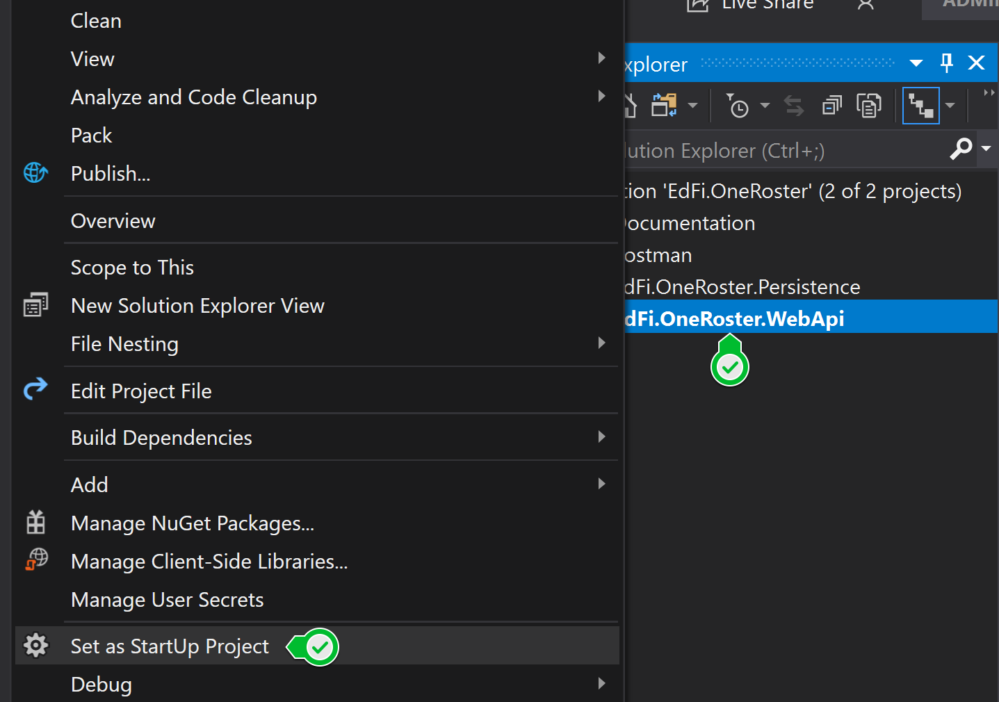

# Ed-Fi > OneRoster > Clever Integration API


This solution was made possible thanks to the support from the Great Oaks Foundation and the Michael and Susan Dell Foundation.

## Description

This is solution is a .Net Core API that generates OneRoster standard endpoints off of the Ed-Fi ODS v3.x PostgreSQL database. This API is then configured in Clever to be able to sync Ed-Fi with the Clever rostering services.
It is important to note that we did not implement the full OneRoster Spec. We only implemented the endpoints and functionality required by Clever.
The following enpoints were implemented:
* Orgs
* AcademicSessions
* Courses
* Classes
* Users
* Demographics
* Enrollments

## Prerequisites
### Minimum System Requirements
A machine or virtual machine with internet access.

* 50GB free storage space
* 4GB+ of available RAM
* Windows Server 2019 or a Linux Server that can run .Net Core
* Administrator access to physical machine or virtual machine

### Software Requirements

* PostgreSQL Server 12 or higher
* .Net Core 3.1
* A Web server capable of hosting a .Net Core application. (We tested on: IIS - Internet Information Services)

That is it =)

For production environments you will need to install ASP.NET Core Runtime Hosting Bundle. https://dotnet.microsoft.com/download/dotnet-core/3.1

## Setup Instructions

We tried to make it as easy as possible to run in a developer machine and in production. Please follow these steps to get started:
### 1. Download or Clone the Code
  * Download the [Ed-Fi OneRoster Clever API Application](https://github.com/Ed-Fi-Exchange-OSS/Ed-Fi-Clever-Integration/archive/main.zip) zip file.
  * Unblock the ZIP file by right-clicking on it, choosing **Properties**, checking **Unblock**, and selecting **OK**.
  * Unzip or copy the solution files to C:\Ed-Fi\Clever\

Alternatively, you can clone this repository.
```
git clone git@github.com:Ed-Fi-Exchange-OSS/Ed-Fi-Clever-Integration.git
```


### 2. Open and run the solution
Once you have extracted the solution files into C:\Ed-Fi\Clever\ follow these steps:

* Open Visual Studio 2019
* Open the solution file (EdFi.OneRoster.sln)
* Select Build > Build Solution (or press Ctrl+Shift+B) to build the solution
* Set the EdFi.OneRoster.WebApi as the Start Up project 
  <br/>
* Run the application inside Visual Studio 2019. Select **Debug** > **Start Debugging** (or press **F5**)

The downloaded solution comes with a populated appsettings.json file so that everything will work on the first run.

If you want to run the solution against your local database and update the API credentialls please read along in the [Production Setup Instructions](#Production-Setup-Instructions)

### 3. Consume the API through Postman
In the root of the solution there are 2 Postman files. The first one is the Postman collection and the second one is a development environment file. You can use these to test the api.

* Ensure the solution is running in visual studio.
* Open Postman and import both files located in C:\Ed-Fi\Clever\
  * Collection: Ed-Fi ODS One Roster Standard API.postman_collection.json
  * Environment: One Roster Dev.postman_environment.json
* From the dropdown at the top right ensure you have selected the "One Roster Dev" environment.
<br/>
* On the right side expand the "OneRoster Standard API" collection and select the "1.- GetOrgs" GET request and click the Send button. It will execute the request and show you results in the lower panel like the image below.
<br/>

## Production Setup Instructions
**Note** that for a production deployment it is a **must** to change the settings defined below. There is a big **security risk** if you do not change the client_id and client_secret as this is a public repository and the whole internet knows about these credentials. If you do not change these you could potentially expose student rostering data.

### Update the AppSettings.json File
In the appsettings.json file that is located in the root of the solution you must update:
1. The **Database Connection String** to point to your PostgreSQL Ed-Fi Instance.
2. The **API Clients** list must be replaced with a new client_id and client_secret. This list can also contain multiple "API Clients" in the case you need to give multiple applications access to this API.
For example: 
```
"Clients": {
      "6c16ddc1": "96504f1498b8e28783cb6a07",
      "[new Client_Id]": "[new Client_Secret]",
      "sample1Id": "sampleSecret1",
      "sample2Id": "sampleSecret2",
      ...      
    },
```
<br/>

### Install the views
1. Open your favorite Database Management Tool. In this example I am going to use DBeaver.
2. Connect to the Ed-Fi ODS v3.x PostgreSQL instance with a user that has sufficient proviledges to create views.
3. Locate the view scripts C:\Ed-Fi\Clever\OneRoster.Persistence\Database\PostgreSQL\Scripts
4. Execute the schema file first 1onerosterv11.schema.sql
5. Execute the rest of the files. The order does not really matter.
  * academicSessions.view.sql
  * classes.view.sql
  * courses.view.sql
  * demographics.view.sql
  * enrollments.view.sql
  * orgs.view.sql
  * users.view.sql
6. You are all done. 

At this point you should be able to open Postman, update the Key and Secret in the Environment dropdown and test the endpoints.

## Legal Information

Copyright (c) 2020 Ed-Fi Alliance, LLC and contributors.

Licensed under the [Apache License, Version 2.0](LICENSE) (the "License").

Unless required by applicable law or agreed to in writing, software distributed
under the License is distributed on an "AS IS" BASIS, WITHOUT WARRANTIES OR
CONDITIONS OF ANY KIND, either express or implied. See the License for the
specific language governing permissions and limitations under the License.

See [NOTICES](NOTICES.md) for additional copyright and license notifications.